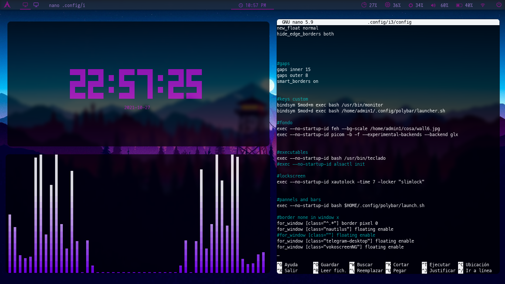
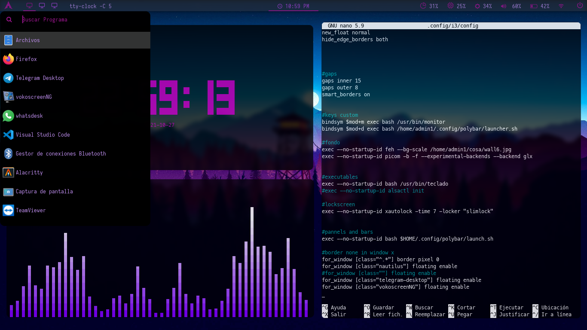
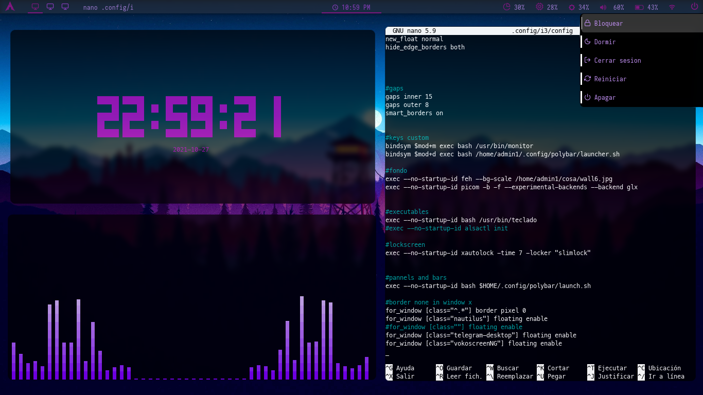
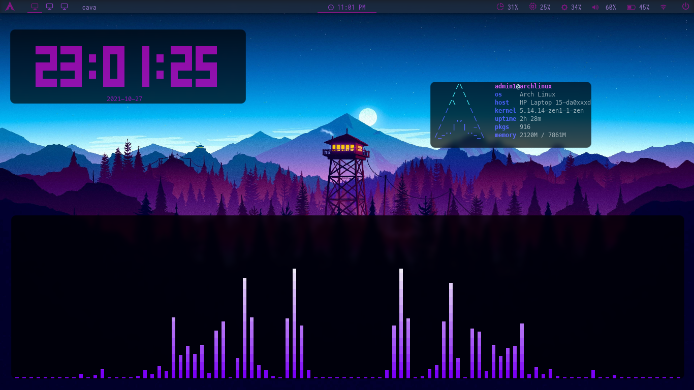
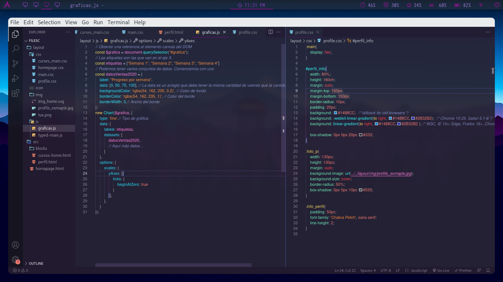

# i3 - TWM

Archivos de configuracion para el Tiling Window Manager [i3]


- OS: Arch Linux
- WM: i3
- Terminal: lxterminal
- Audio: alsa, pulseaudio
- font: Iosevka & feather
- Wallpaper: custom
- blockscreen: SLiM
<br>
<!-- img -->


### Usa rofi para desplegar un menu para abrir todas las aplicaiones



### Un menu para acciones de: [bloqueo, reinicio, apagado, suspencion, cierre de sesion]



### Modo Float

<br>


Este repositorio contiene los archivos necesarios para que i3 se vea como en la imagen.

## Instalacion


Dependencias: <br> `i3` <br> `polybar` <br> `rofi` <br> `picom` <br> `slim`
 

- Instalacion de paquetes necesarios:
```
 pacman -S i3
```
```
 pacman -S picom
```
```
 pacman -S rofi
```
```
 pacman -S slim
```
- Para instalar polybar se necesita del gestor de paquetes <a href="#yay">yay<a>
```
 yay -S polybar
```
- Clonar este repositorio
```
 git clone https://github.com/yenoth/dotfiles.git
```

## Configuracion
```
 cd dotfiles
```
```
 bash script
```
- Reinicie y listo.
 
<h2 id="yay">yay</h2>

- Instalacion del gestor de paquetes yay <sup>AUR</sup> 
 
```
 pacman -S git
```
```
 git clone https://aur.archlinux.org/yay.git
```
```
 cd yay  
```
```
 makepkg -si  
```

  
